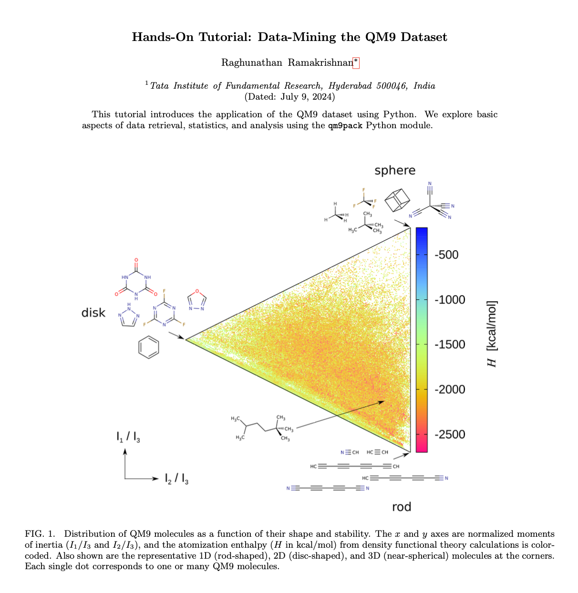

# `QM9PACK` ✨

 A Python package for data-mining the QM9 dataset

# Installation details

## Install Dependencies

- Ensure you have the following dependencies installed:
  - `numpy`
  - `pandas`
  - `scipy`
  - `matplotlib`

```
pip3 install numpy pandas scipy matplotlib
```
  
- If you want to convert a SMILES string to an SVG image, also install:
  - `rdkit`

## Install directly from PyPI 

```
   pip3 install qm9pack
```

## Alternatively, download and Install the Package

Clone the repository and install the package:

```
git clone git@github.com:raghurama123/qm9pack.git
cd qm9pack
python3 -m pip install -e .
```

# Tutorial

Click the image below for a PDF the latest version of the tutorial.


<a href="https://github.com/raghurama123/qm9pack/blob/main/Tutorial_QM9PACK.pdf">

</a>

All the Python codes used in the tutorial are in the [tutorials folder](https://github.com/raghurama123/qm9pack/tree/main/tutorials). The codes are named according to the section/subsection in the tutorial. 

# Support e-mail
 `ramakrishnan@tifrh.res.in` 
 `raghu.rama.chem@gmail.com`

# How to cite?
If you find this module useful and have  used it in your work, please cite it as   

_QM9PACK: A Python package for data-mining the QM9 dataset_     
Raghunathan Ramakrishnan      
https://github.com/raghurama123/qm9pack

```
@misc{qm9pack,
  title   = {QM9PACK: A Python package for data-mining the QM9 dataset},
  author  = {Ramakrishnan, Raghunathan},
  year    = {2024},
  url = {https://github.com/raghurama123/qm9pack}
}
```

Additionally, please also cite the QM9 study 

[_Quantum chemistry structures and properties of 134 kilo molecules_](https://doi.org/10.1038/sdata.2014.22)    
Raghunathan Ramakrishnan, Pavlo O. Dral, Matthias Rupp, O. Anatole von Lilienfeld    
Scientific Data volume 1, Article number: 140022 (2014)   

```
@article{ramakrishnan2014quantum,
  title={Quantum chemistry structures and properties of 134 kilo molecules},
  author={Ramakrishnan, Raghunathan and Dral, Pavlo O and Rupp, Matthias and Von Lilienfeld, O Anatole},
  journal={Scientific data},
  volume={1},
  number={1},
  pages={1--7},
  year={2014},
  publisher={Nature Publishing Group},
  url={https://doi.org/10.1038/sdata.2014.22}
}
```
